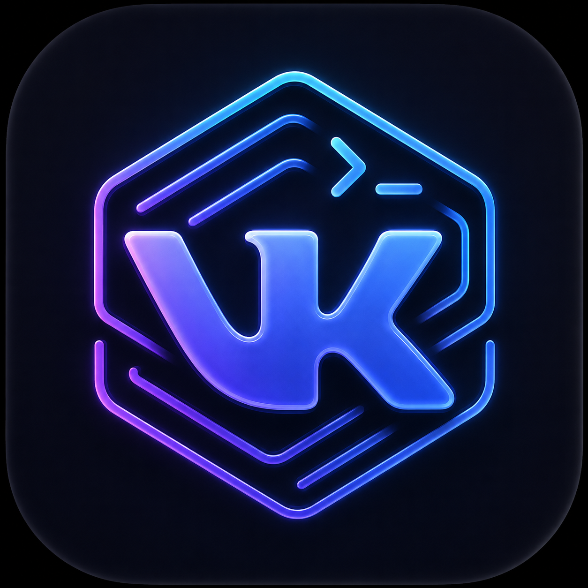
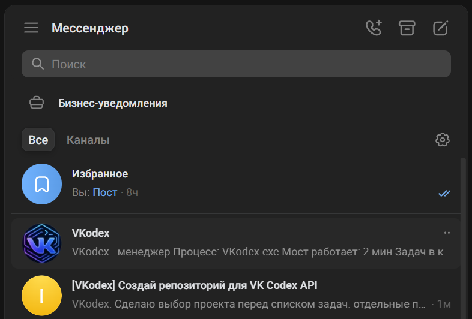

<p align="center">
  <strong>Русский</strong> · <a href="README_EN.md">English</a>
</p>

<p align="center">
  
</p>

# VKodex

**VKodex — открытый бот для удалённого управления OpenAI Codex через сообщения и беседы ВКонтакте.**

Продолжайте существующие задачи Codex или создавайте новые с телефона: выбирайте проект в менеджерском диалоге, открывайте связанную VK-беседу, отправляйте уточнения и вложения в тот же контекст.

<p align="center">
  
</p>

Личный диалог с сообществом — менеджер. Отдельная VK-беседа — одна задача Codex. Комментарии агента приходят без уведомлений, готовые ответы — обычными сообщениями.

**Статус: экспериментальное подключение к десктопу Windows.** Для live-событий VKodex использует внутренний IPC приложения, который может измениться после обновления Codex; совместимость автоматически проверяется при запуске и во время работы. Создание новых задач и безопасное продолжение задачи без live-владельца выполняются через официальный Codex SDK. Начните с проверки на неважной задаче.

## Содержание

- [Требования и схема подключения](#requirements)
- [Установка VKodex](#install)
- [Сообщество VK, ключ API и численные ID](#vk-api)
- [Конфигурация](#configuration)
- [Проверка и первый запуск](#first-run)
- [Менеджер и связанные беседы](#usage)
- [Дополнительные каталоги Codex](#codex-homes)
- [Постоянная работа и VPN](#runtime)
- [Обновление и резервные копии](#maintenance)
- [Решение проблем](#troubleshooting)
- [Безопасность и ограничения](#security)
- [Прежний режим на Codex SDK](#legacy-sdk)
- [Разработка и лицензия](#development)

<a id="requirements"></a>

## 1. Требования и схема подключения

| Компонент | Что нужно |
| --- | --- |
| Компьютер | Windows с запущенным десктопным Codex. VKodex запускается на том же компьютере и под тем же пользователем Windows. |
| Codex | Рабочая авторизация и доступ хотя бы к одному локальному проекту. Для подключения существующей задачи проверьте, что она отвечает непосредственно в приложении. |
| Node.js | Рекомендуется [Node.js 24 LTS](https://nodejs.org/en/download). Проект также проверяется в CI на Node.js 22. |
| npm | В проекте и CI используется `11.12.1`. |
| Git | [Git для Windows](https://git-scm.com/install/windows) для загрузки и обновления репозитория. |
| VK | Ваш аккаунт, отдельное сообщество под вашим управлением и ключ сообщества с доступом к сообщениям. |
| Сеть | Для типичного запуска из России нужна раздельная маршрутизация: VKodex обращается к VK API и Long Poll напрямую через российский IP, а Codex/OpenAI — через VPN. |

Установите и авторизуйте десктопное приложение по [официальной инструкции для Windows](https://learn.chatgpt.com/docs/windows/windows-app). В актуальной документации оно называется ChatGPT desktop app; для задач разработки используется Codex. Порядок входа и создания первой задачи описан в [официальном quickstart](https://learn.chatgpt.com/docs/quickstart?setup=app).

Для подключения к уже авторизованному десктопу **не нужно добавлять `OPENAI_API_KEY` в VKodex**. Авторизацию, модель, доступ к файлам и разрешения на команды определяет сама задача Codex. Ключ VK — отдельный ключ другого сервиса.

Публичный IP, домен, HTTPS-сертификат и входящий порт не нужны: VKodex сам получает события через Bots Long Poll. Отдельное приложение VK и пользовательский токен VK для этого режима не требуются.

Развёртывание на VPS, внутри Docker или WSL не заменяет запуск рядом с Windows-десктопом. Docker-файлы в репозитории относятся к [прежнему SDK-режиму](#legacy-sdk). Поддержка других ОС для живого десктопного подключения здесь не заявлена.

<a id="install"></a>

## 2. Установка VKodex

Все команды ниже выполняются в **PowerShell**. После установки Node.js и Git откройте новое окно терминала.

Проверьте инструменты:

```powershell
git --version
node --version
npm --version
```

Скачайте репозиторий в папку, где хотите его хранить:

```powershell
git clone https://github.com/RedRatInHat/VKodex.git
Set-Location VKodex
npm install --global npm@11.12.1
npm ci
npm run check
npm run runtime:prepare
```

`npm ci` устанавливает зависимости по зафиксированному lock-файлу. `npm run check` проверяет TypeScript, запускает тесты и собирает проект; для этих тестов реальные ключи не нужны.

`runtime:prepare` создаёт отдельный исполняемый файл `VKodex.exe` и выводит путь к нему. Подробности — в разделе [процесс и VPN](#runtime).

Создайте локальную конфигурацию. Защита в примере не даст случайно перезаписать существующую `.env`:

```powershell
if (Test-Path -LiteralPath .env) {
    throw '.env уже существует. Откройте его для редактирования, не копируйте шаблон поверх.'
}
Copy-Item -LiteralPath .env.example -Destination .env
notepad .env
```

Пока оставьте файл открытым: следующие шаги объясняют, чем заполнить ключ и ID. Не публикуйте заполненную `.env`.

<a id="vk-api"></a>

## 3. Сообщество VK, ключ API и численные ID

### 3.1. Создайте отдельное сообщество

1. Откройте раздел сообществ в VK и создайте сообщество для вашего экземпляра VKodex. Название и короткий адрес могут быть любыми.
2. Убедитесь, что у вашего аккаунта есть права управления этим сообществом.
3. Не используйте сообщество, сообщения которого уже обрабатывает другой бот: два получателя Long Poll могут конфликтовать.

Сообщество из скриншота — пример интерфейса, а не общий сервер. Для своей установки используйте **собственное сообщество и собственный ключ**.

### 3.2. Включите сообщения и работу в беседах

В управлении сообществом откройте раздел **Сообщения** и включите сообщения сообщества.

В подразделе с настройками бота включите возможности ботов и разрешение добавлять сообщество в беседы, если эти переключатели доступны. Названия пунктов могут различаться между версиями интерфейса VK.

Откройте обычную страницу сообщества со своего аккаунта и отправьте ему, например, `Привет`. Это создаст личный диалог с будущим менеджером. До запуска VKodex автоматического ответа не будет. Если VK предлагает разрешить сообщения от сообщества, разрешите их.

### 3.3. Настройте Bots Long Poll

Откройте **Управление → Работа с API → Long Poll API**:

| Настройка | Значение |
| --- | --- |
| Long Poll API | Включён |
| Версия API | **5.199** |
| Тип события «Входящее сообщение» | `message_new` — включён |
| События действий с кнопками | `message_event` — включён |

`message_new` нужен и для текста, и для служебных событий бесед. `message_event` нужен для кнопок меню. Настройка Callback API, адрес сервера и строка подтверждения для VKodex не нужны.

Не выбирайте другую версию просто потому, что она новее: адаптер и команда проверки рассчитаны на **5.199**. Сохраните изменения. Параметры Long Poll описаны в [официальной схеме VK](https://github.com/VKCOM/vk-api-schema/blob/master/groups/methods.json).

### 3.4. Получите ключ сообщества

1. В разделе **Работа с API → Ключи доступа** выберите создание ключа.
2. Выдайте доступ к **сообщениям сообщества**. Другие права без необходимости не добавляйте.
3. Подтвердите действие способом, который запросит VK.
4. Скопируйте выданную строку целиком в `VK_GROUP_TOKEN` локального файла `.env`.

Нужен именно **ключ доступа сообщества**, не сервисный ключ приложения и не ключ личного аккаунта. Не вставляйте его в сообщения боту, issue, скриншоты, ссылки или команды терминала с явным значением токена.

Если ключ оказался опубликован, отзовите его в VK и создайте новый. Одного удаления текста из файла недостаточно.

### 3.5. Найдите ID сообщества и свой ID

В конфигурации используются положительные числа:

| Поле | Что указывать |
| --- | --- |
| `VK_GROUP_ID` | Численный ID сообщества, без минуса и без `club`/`public`. |
| `VK_OWNER_ID` | Численный ID вашего личного VK-аккаунта, без `id`. Только один пользователь. |

Если адрес содержит `club<число>`, `public<число>` или `id<число>`, нужен его числовой суффикс. Короткое имя вроде `my_vk_bridge` вместо числа не подойдёт.

**Если виден только короткий адрес**, можно получить ID через [`utils.resolveScreenName`](https://github.com/VKCOM/vk-api-schema/blob/master/utils/methods.json). Этот метод поддерживает ключ сообщества. Для следующей команды достаточно уже заполненного `VK_GROUP_TOKEN`; два ID пока могут быть пустыми.

Выполните из папки VKodex:

```powershell
$screenName = Read-Host 'Короткий адрес без https://vk.ru/ и без завершающего слеша'
$runtime = Join-Path $env:LOCALAPPDATA 'VKodex/runtime/VKodex.exe'

@'
import { VK } from "vk-io";

const token = process.env.VK_GROUP_TOKEN?.trim();
const screenName = process.argv[2]?.trim();
if (!token || !screenName) {
  console.error("Заполните VK_GROUP_TOKEN в .env и укажите короткий адрес.");
  process.exit(1);
}

try {
  const vk = new VK({ token, apiVersion: "5.199", apiRetryLimit: 0 });
  const result = await vk.api.utils.resolveScreenName({ screen_name: screenName });
  if (!result || !Number.isSafeInteger(result.object_id) || !["user", "group", "page", "event"].includes(result.type)) {
    console.error("Профиль или сообщество не найдены. Проверьте короткий адрес.");
    process.exitCode = 1;
  } else {
    console.log("Тип: " + result.type + "; ID: " + result.object_id);
  }
} catch (error) {
  const code = Number.isSafeInteger(error?.code) ? error.code : "нет ответа";
  console.error("Ошибка VK: " + code);
  process.exitCode = 1;
}
'@ | & $runtime --env-file=.env --input-type=module - $screenName
```

Запустите её сначала для адреса сообщества, затем для адреса своего профиля. Для профиля ожидается тип `user`, для сообщества — `group`, `page` или `event`. Перенесите полученные числа в соответствующие поля `.env`.

Команда только читает ID и не создаёт сообщений. Токен берётся из локального файла и не выводится. Результат содержит ваш личный ID: не прикладывайте этот вывод к публичным отчётам.

<a id="configuration"></a>

## 4. Конфигурация

Для десктопного режима достаточно следующих полей в `.env`:

```dotenv
VK_GROUP_TOKEN=
VK_GROUP_ID=
VK_OWNER_ID=

BOT_DATA_DIR=./data/desktop
CODEX_HOME=
CODEX_EXTRA_HOMES=[]
HEALTH_CHECK_INTERVAL_MS=60000
```

**Первые три поля нужно заполнить своими значениями.** Пустые строки выше не являются рабочей конфигурацией.

| Переменная | Обязательна | Назначение |
| --- | --- | --- |
| `VK_GROUP_TOKEN` | Да | Полная строка ключа сообщества с доступом к сообщениям. |
| `VK_GROUP_ID` | Да | Один положительный численный ID сообщества. |
| `VK_OWNER_ID` | Да | Один положительный численный ID владельца. Сообщения остальных пользователей не управляют задачами. |
| `BOT_DATA_DIR` | Нет | Папка приватной базы, очереди и привязок. По умолчанию десктопный адаптер использует `./data/desktop`. |
| `CODEX_HOME` | Нет | Основной каталог данных Codex. Пустое значение означает `~/.codex`. Это не папка проекта с исходниками. |
| `CODEX_EXTRA_HOMES` | Нет | JSON-массив дополнительных каталогов данных, максимум 16. По умолчанию `[]`. |
| `HEALTH_CHECK_INTERVAL_MS` | Нет | Интервал полной эксплуатационной проверки. По умолчанию 60 секунд; допустимо от 30 секунд до одного часа. |

В общем `.env.example` сохранены настройки прежнего SDK-бота, включая `BOT_DATA_DIR=./data`. Для нового десктопного запуска поставьте **`BOT_DATA_DIR=./data/desktop`**, чтобы не использовать базу старого режима. Если у вас уже работает десктопная установка с другим путём, сохраните её существующий путь.

`VK_OWNER_IDS`, `VK_ALLOWED_USER_IDS`, `WORKSPACE_ROOTS`, `CODEX_MODEL`, `CODEX_APPROVAL_POLICY`, `MAX_INBOUND_*` и другие настройки SDK-режима не управляют десктопным адаптером. Здесь используется **`VK_OWNER_ID` в единственном числе**. Разрешения и модель берутся из задачи Codex; модель следующего хода можно менять через меню.

После изменения `.env` перезапустите только VKodex. Закрывать работающие задачи Codex не нужно.

<a id="first-run"></a>

## 5. Проверка и первый запуск

### 5.1. Проверьте VK

```powershell
npm run vk:check
```

В норме все проверки отмечены `OK`:

```text
messages_permission
long_poll
message_new
message_event
event_version
long_poll_server
```

Эта команда только читает настройки: не создаёт бесед, не отправляет сообщений и не подключается к Codex. Если есть `FAIL`, исправьте указанную настройку до запуска.

Успешная проверка подтверждает права на сообщения и Long Poll. Возможность создать беседу и получить ссылку-приглашение проверяется отдельно при первом подключении задачи.

### 5.2. Проверьте каталог Codex

Откройте Codex и задачу, которую хотите подключить:

```powershell
npm run desktop:probe
```

Команда выводит количество источников, задач и проектов. Для просмотра каталога ключ VK не нужен. Если `taskCount` равен нулю или `unreadableSources` больше нуля, проверьте каталоги в конфигурации.

При известном ID задачи можно проверить и живую подписку:

```powershell
$threadId = Read-Host 'ID открытой задачи Codex'
npm run desktop:probe -- $threadId
```

Эта проверка читает состояние, не отправляет промптов и не запускает ход. Ожидаемый признак успешного подключения — `subscribed: true`. При совпадении ID в нескольких каталогах проверка попросит выбрать один источник; обычный менеджер различает такие копии.

### 5.3. Запустите мост

После успешного `npm run check` сборка уже готова:

```powershell
npm run desktop:start
```

Для запуска из TypeScript во время разработки:

```powershell
npm run desktop:dev
```

Выберите **одну** из этих команд. Не запускайте два экземпляра с одним сообществом или одной базой. `npm start` и `npm run dev` запускают другой, SDK-режим.

Дождитесь строки:

```text
VKodex desktop bridge: VK Long Poll started.
```

Оставьте терминал и Codex работающими. Через несколько секунд проверьте первый отчёт:

```powershell
npm run health:check
```

Команда должна завершиться со статусом `Health: OK`. Для штатной остановки моста нажмите **Ctrl+C в его терминале**. Это не команда остановки задачи Codex.

### 5.4. Подключите первую задачу

1. Со своего разрешённого VK-аккаунта откройте личный диалог с сообществом и отправьте `/menu`.
2. Нажмите **Задачи Codex** или отправьте `/list`.
3. Выберите проект, **Без проекта** или **Все подряд**, затем нужную задачу.
4. Бот создаст или найдёт связанную VK-беседу и пришлёт ссылку в менеджер.
5. Если VK не добавил вас автоматически, вступите по присланной ссылке. Связь с задачей уже включена: отдельного подтверждения вступления нет.
6. В связанной беседе отправьте простой тестовый запрос, например: «Кратко опиши текущую задачу, ничего не меняя».
7. Убедитесь, что сообщение поступило в **ту же задачу** в десктопе, а её ответ появился в VK.

Проверяйте сначала на неважной задаче. Внутренний протокол приложения не является стабильным публичным API; тесты проекта не гарантируют совместимость со всеми версиями Codex.

<a id="usage"></a>

## 6. Менеджер и связанные беседы

### Менеджер

Менеджер находится в **личном диалоге с сообществом**, а не в дополнительной общей беседе.

| Команда или кнопка | Действие |
| --- | --- |
| `/menu`, `/start`, `/status` | Открыть меню с технической информацией о мосте. |
| `/help` | Показать допустимые команды менеджера. |
| `/health`, «Проверить здоровье» | Немедленно перепроверить VK, очередь, SQLite, каталоги Codex, API целей, named pipe, stream protocol и активные трансляции. |
| `/limits`, «Лимиты Codex» | Показать каталог, аккаунт, использованный процент лимитов, время сброса, тариф и доступные кредиты. В менеджере показываются все настроенные каталоги; в связанной беседе — только аккаунт каталога этой задачи. Команда не передаётся агенту. |
| `/list`, «Задачи Codex» | Сначала выбрать проект, затем задачу. |
| `/new`, «Новая задача» | Создать пользовательскую задачу: проект → локальная папка или отдельный Git worktree → название → стартовый промпт → модель → уровень рассуждения. |
| `/cancel` | Отменить незавершённый мастер создания задачи. |
| «Проекты» | Посмотреть названия проектов и их рабочие папки. |
| «Без проекта» | Задачи, для которых подтверждено отсутствие проекта. |
| «Все подряд» | Все найденные пользовательские задачи, включая задачи с неизвестной принадлежностью к проекту. |
| «Выбрать проект» | Вернуться к выбору проекта. |
| «Обновить» | Обновить выбранный экран вручную. |
| «Отключить трансляцию» | Отвязать трансляцию, сохранив задачу Codex. |

Список разбит на страницы; выбранный проект сохраняется при перелистывании. Служебные задачи агентов и архивные задачи не показываются. Название берётся из индекса имён Codex, затем из локальной базы. Длинный стартовый промпт не подставляется вместо имени.

В служебных ответах менеджера есть кнопка **Меню**. В меню видны процесс и время работы моста, количество задач и связей, очередь отправки и последний полный health-отчёт. Полное меню открывается только по запросу; отдельное приветствие при запуске не присылается.

Входящие события упорядочиваются отдельно для каждой VK-беседы. Зависшее подключение одной задачи не удерживает менеджер и остальные задачи. Через 45 секунд watchdog освобождает очередь этой беседы и сообщает, что результат операции неизвестен; изменяющая команда автоматически не повторяется.

Новая задача создаётся официальным Codex SDK в том же `CODEX_HOME`, поэтому появляется в обычном каталоге Codex. В режиме **Локально** используется сохранённая рабочая папка проекта. В режиме **Отдельный worktree** VKodex вызывает `git worktree add --detach` и создаёт соседнюю папку вида `<репозиторий>_VKodex_<идентификатор>_worktree`; автоматического удаления worktree нет. Если запуск задачи подтверждён, а последующий ответ VK потерян, мастер помечает результат как неопределённый и не создаёт дубликат.

### Беседа задачи

Обычное сообщение продолжает связанную задачу. Во время работы агента оно передаётся как уточнение; после завершения — как следующий ход в том же контексте. Автором промпта может быть любой участник связанной беседы: мост игнорирует только собственные сообщения сообщества и уже обработанные исходящие сообщения. Состав беседы не проверяется. При неподтверждённом состоянии Codex или потерянном ответе запрос не повторяется автоматически.

Если связь явно отключена через `/detach` или архивирование, входящее сообщение не включает её скрытно. В личный менеджер приходит объяснение и кнопка повторного подключения. После подключения повторите исходное сообщение. Для беседы, которая вообще не связана с задачей, менеджер предложит открыть список задач. Выход участника и другие изменения состава беседы связь не отключают.

Строка **Меню задачи:** и кнопка **Меню** добавляются в конец итогового ответа Codex; у длинного ответа — только в последнюю часть. Отдельного сообщения с меню при подключении или завершении хода нет. Кнопка открывает актуальную карточку, даже если предыдущие кнопки настроек уже устарели. До первого ответа меню можно открыть командой `/menu`.

| Действие | Что происходит |
| --- | --- |
| `/menu`, `/status` | Открывается техническая карточка задачи. |
| `/help` | Показать допустимые команды этой беседы. |
| `/files` | Проверить папки отправки этой связи и передать новые готовые файлы в VK. |
| `/goal`, «Цель» | Показать цель Codex, её статус, бюджет, расход токенов и время работы. Через меню можно задать или изменить формулировку и бюджет, поставить цель на паузу, возобновить либо снять её. Завершённой цель отмечает сам агент после проверки результата. |
| «Модель / рассуждение» | Выбор модели и уровня рассуждения для следующего хода из доступного кеша Codex. Текущий ход не прерывается. |
| «Обновить» | Обновляются статус, модель и заполнение контекстного окна. |
| «Переименовать» | После ввода и подтверждения имя сохраняется в Codex, затем VK-беседа получает название `[VKodex] <имя>`. Переименование в самом Codex автоматически переносится в связанную VK-беседу. |
| «Архивировать» | После подтверждения архивируется неработающая задача; трансляция отключается. |
| «Рабочая директория» | Папка задачи присылается текстом. |
| «Диплинк» | Локальная ссылка для открытия задачи в десктопе. |
| «Markdown-файл» | Экспорт видимой переписки, если история полная и не превышает 2 МБ. |
| «Поделиться» | Диплинк и экспорт. Публичная ссылка автоматически не создаётся. |
| «Переместить в проект» | Сохранить новую принадлежность задачи проекту Codex либо убрать её из проекта. Рабочая директория уже существующей задачи не перемещается. |
| `/stop` | Прервать активный ход в этой задаче. Команда подтверждает ID прерванного хода и не архивирует задачу. |
| `/detach` | Отключается только трансляция. Задача не прерывается и не архивируется. |

Неизвестная slash-команда владельца показывает соответствующую справку и не передаётся агенту. Сообщения остальных участников связанной беседы, включая текст, начинающийся с `/`, по-прежнему считаются обычными промптами.

Значение контекста — последняя оценка Codex, а не суммарное количество потраченных за задачу токенов. Отсутствующие данные не угадываются. Диплинк полезен на устройстве с установленным десктопным приложением; бот не меняет буфер обмена телефона.

**Синхронизация названия:** переименование через меню VK сохраняет имя в каталоге Codex и меняет связанную беседу на `[VKodex] <имя>`. Переименование штатными средствами Codex обнаруживается при обновлении каталога и автоматически переносится в VK, в том числе после перезапуска моста. При временной ошибке VK автоматическая синхронизация повторяется с увеличивающимся интервалом; кнопку «Повторить для VK» можно использовать немедленно. Старое подтверждение не выполняет операцию повторно и не может перезаписать более новое имя.

Локальный API Codex может сохранить имя в каталоге, не обновив кеш уже открытого окна. Мост отдельно показывает подтверждение живой задачи, не перезапускает приложение и никогда не передаёт название как промпт агенту. Для немедленного обновления такого окна используй штатное переименование в Codex.

### Какие сообщения приходят в VK

- Во время работы хода внизу переписки циклически меняется `думаю...` → `думаю..` → `думаю.`. Если последнее сообщение — комментарий агента, индикатор добавляется в его конец. После вашего сообщения, меню или другого ответа бот при необходимости отправляет новый тихий индикатор ниже; старый больше не анимируется. Обновление — раз в двадцать секунд, чтобы длительная задача не упиралась в flood control VK. После завершения строка исчезает из комментария, отдельный индикатор показывает `Готово.`; ошибки и потеря связи показываются явно. При отключении трансляции редактирование прекращается.
- Каждый комментарий агента — отдельное **тихое сообщение**. Дописывание того же комментария редактирует его сообщение не чаще одного раза в двадцать секунд, чтобы поток нескольких задач не включал flood control VK. Финальные ответы и запрошенные панели этим интервалом не задерживаются.
- Готовый ответ — отдельное сообщение с обычным уведомлением и кнопкой **Меню**.
- Ваше сообщение из десктопа — с заголовком `## user request`; у длинного запроса заголовок повторяется в каждой части.
- Сообщение, пришедшее из VK, не должно возвращаться в ту же беседу дубликатом.
- Команды, их вывод, изменения файлов, события инструментов и скрытые рассуждения не пересылаются.

Автоматический предпросмотр ссылки не мешает передаче текста: если URL уже есть в сообщении, карточка VK не считается отдельным файлом. Ошибки обработки запроса приходят в ту беседу, из которой он отправлен.

Звук и показ уведомлений зависят также от клиента и настроек VK. Вся история до первого подключения автоматически не копируется.

Если VK ограничивает частоту запросов, доставка делает общую паузу: при ошибке `6` — секунду, при `9` или `29` — две минуты. Пауза сохраняется при перезапуске; сообщения остаются в очереди. В это время анимация и доставка могут временно остановиться.

### Фотографии и документы

**В VK → Codex:** прикрепите фотографию или документ к обычному сообщению в связанной беседе. Можно отправить только вложения, без текста. Фото поступает в ту же задачу как изображение, документ — как локальный файл с указанным путём. Вложения в ответах и пересланных сообщениях тоже проверяются. При ошибке скачивания запрос целиком отклоняется, чтобы агент не продолжил работу без нужного файла.

Принимаются до **10 файлов**, каждый не больше **20 МиБ**, суммарно не больше **50 МиБ** на сообщение. На скачивание одного файла отведено 30 секунд. Видео, голосовые сообщения, стикеры и другие отдельные типы вложений пока не поддерживаются; передайте их как документ. В менеджере и вместе с командами вроде `/menu` файлы не принимаются.

**Codex → VK:** каждый запрос из связанной беседы получает собственную папку отправки. Попросите агента сохранить туда нужный результат, например: «Сделай CSV и положи его в папку отправки VKodex». После завершения хода мост загружает готовые файлы в эту беседу. Изображения отправляются как фото, остальные файлы — как документы; если VK не принимает формат фото, используется документ. Для сохранения исходных байтов изображения, которые VK может сжать, отправляйте его в архиве. Команда `/files` позволяет проверить папку вручную, в том числе до завершения хода.

Входящие файлы сохраняются в `BOT_DATA_DIR/files/<идентификатор-запроса>/inbox/`, исходящие — в соседней `outbox/`. Идентификатор создаёт мост; точный путь передаётся агенту в запросе. Это не папка проекта. Разрешения задачи Codex не расширяются: если её ограничения не позволяют работать с этой папкой, разрешите доступ штатным способом в десктопе. Запросы, отправленные прямо из десктопа, не получают новую папку автоматически.

Для исходящих файлов действуют те же ограничения количества и размера на папку. Мост отправляет только обычные файлы из `outbox/`: скрытые файлы пропускаются, ссылки и файлы, которые ещё записываются, отклоняются. Пути из текста ответов и остальные каталоги проекта не сканируются. Архивы автоматически не распаковываются. Содержимое документов остаётся пользовательскими данными, а не командами для моста.

Повторная проверка и перезапуск не отправляют неизменившийся файл второй раз. Перед скачиванием, загрузкой и отправкой проверяется активность привязки, но не состав беседы. После отключения связи старые папки не отправляются автоматически при повторном подключении. Локальные файлы сохраняются; очищайте ненужные данные вручную через корзину и не добавляйте папку `BOT_DATA_DIR` в Git.

### Выход из беседы и отключение связи

Изменения состава беседы не приостанавливают и не отключают трансляцию. Если владелец вышел, мост может продолжить отправлять прогресс и ответы оставшимся участникам. Любой участник, кроме самого бота, может продолжать задачу обычными сообщениями. Удаление бота из беседы естественным образом лишает мост возможности доставлять сообщения в VK, но не служит командой отключения привязки.

Чтобы остановить трансляцию предсказуемо, владелец должен сначала отправить `/detach` или отключить её через менеджер. Это закрывает подписку на Codex и отменяет ещё не отправленную очередь; сама задача Codex продолжает работать. Для восстановления выберите задачу в менеджере снова. Отклонённые во время явного отключения сообщения автоматически не повторяются.

Удаление переписки **только у себя** не имеет отдельного события в [API сообщества VK](https://github.com/VKCOM/vk-api-schema/blob/master/callback/objects.json) и также не отключает связь. Уже отправленное или находящееся в обработке VK сообщение отозвать через `/detach` нельзя.

<a id="codex-homes"></a>

## 7. Дополнительные каталоги Codex

По умолчанию VKodex ищет задачи в `~/.codex`. Чтобы добавить соседний профиль, укажите в `.env`:

```dotenv
CODEX_EXTRA_HOMES='["~/.codex-work"]'
```

Несколько источников:

```dotenv
CODEX_HOME=
CODEX_EXTRA_HOMES='["~/.codex-work", "D:/CodexProfiles/another"]'
```

Это каталоги данных Codex, не репозитории проектов. Основной каталог остаётся в поиске; повторяющиеся пути учитываются один раз. `~` означает домашнюю папку пользователя Windows. Относительные пути считаются от каталога запуска; для явности используйте абсолютные пути. В JSON на Windows удобнее писать `/` вместо обратных слешей.

После правки перезапустите VKodex и обновите список задач. Задачи всех читаемых источников объединяются по времени обновления. Название каталога показывается рядом с задачей только тогда, когда валидные задачи одновременно найдены более чем в одном источнике; пустой или нечитаемый дополнительный каталог не добавляет префикс к основному списку.

Команда `/limits` учитывает эти профили отдельно. В менеджере она читает лимиты каждого настроенного `CODEX_HOME`, а в беседе задачи выбирает источник по сохранённому `sourceId`. Для ChatGPT-авторизации строка **Аккаунт** содержит имя, если Codex его сообщает, и адрес входа; для API key показывается только тип аккаунта. Токены и идентификаторы аккаунта не запрашиваются для отображения, не записываются в базу VKodex и не попадают в Git.

Если дополнительный CLI/work-профиль содержит задачи, но не имеет собственного файла проектов десктопа, VKodex сопоставляет их с общими локальными проектами по рабочей директории. Привязка выполняется только при единственном наиболее точном совпадении корня; остальные задачи остаются в разделе «Без проекта». Копии с одинаковым ID в разных каталогах не смешиваются: у них отдельные VK-привязки, источники истории и кеши моделей.

Для live-чтения событий мост предпочитает владельца задачи в десктопе и проверяет, что путь истории относится к выбранному каталогу. Если задача не загружена в GUI, следующий текстовый ход может быть продолжен резервным процессом Codex SDK в том же `CODEX_HOME`; его события всё равно поступают в связанную VK-беседу. При несовпадении пути живой истории мост блокирует IPC-команду, а при несовместимой версии live-протокола не подменяет её резервным запуском.

Не меняйте основной `CODEX_HOME` при использовании существующей базы VKodex. Добавьте другой каталог в `CODEX_EXTRA_HOMES` либо создайте отдельную установку с другим `BOT_DATA_DIR`. Не редактируйте базы Codex вручную ради привязки к проекту.

<a id="runtime"></a>

## 8. Постоянная работа и VPN

VKodex должен работать всё время, пока вы хотите получать сообщения. Компьютер, десктопное приложение и сеть должны оставаться доступны. Сон, выключение компьютера или закрытие процесса моста прекращают доставку.

### Необходима раздельная маршрутизация

Для стабильной работы из России недостаточно направить весь компьютер либо целиком в VPN, либо целиком в прямое соединение. Настройте split tunneling с двумя маршрутами:

| Трафик | Маршрут |
| --- | --- |
| `VKodex.exe` → VK API, Bots Long Poll и серверы загрузки VK | `DIRECT`, через российский IP |
| Десктопный Codex и его обращения к OpenAI | Через VPN/прокси |

Если пустить VKodex через зарубежный VPN, VK может отвечать нестабильно или не отвечать вовсе. Если вывести Codex из VPN в сети, где OpenAI недоступен напрямую, перестанут запускаться и продолжаться задачи. Поэтому оба маршрута нужно проверить одновременно: `npm run vk:check` должен проходить через прямое соединение, а тестовый ход Codex — через VPN.

Подойдёт TUN-клиент с правилами по приложениям или процессам, например [v2RayTun](https://github.com/LXST-CODE/v2RayTun). Это лишь пример стороннего клиента: VKodex его не устанавливает и не настраивает. Названия пунктов и формат правил зависят от версии клиента.

Штатного установщика службы и автоматической настройки автозапуска пока нет. Для первого развёртывания достаточно отдельного терминала с `npm run desktop:start`.

Если используете Планировщик заданий Windows, задайте параметры вручную:

| Поле | Значение |
| --- | --- |
| Пользователь | Тот же пользователь, под которым работает Codex. |
| Режим | Выполнять только для вошедшего в систему пользователя; не запускать как SYSTEM. |
| Программа | Полный путь к `VKodex.exe`, который вывела `npm run runtime:prepare`. |
| Аргументы | `--env-file=.env dist/src/desktop-main.js` |
| Рабочая папка / «Начать в» | Полный путь к клонированному репозиторию VKodex. |
| Повторный запуск | Не запускать новый экземпляр, если предыдущий уже работает. |

Перед настройкой автозапуска проверьте ручной запуск. Не включайте параллельно задачу Планировщика и процесс в терминале. После перезагрузки потребуется также работающий и авторизованный Codex.

### Отдельный процесс для TUN

На Windows команды запуска используют отдельную копию Node.js:

```text
%LOCALAPPDATA%/VKodex/runtime/VKodex.exe
```

Имя и путь не меняются вместе с расположением репозитория или версией системного Node.js. В v2RayTun, sing-box или другом TUN-клиенте направьте этот процесс в `DIRECT`. Используйте полный путь, если клиент поддерживает правила по пути.

Это исключение касается VKodex, а не всего `node.exe` и не самого Codex. Не добавляйте в `DIRECT` десктопный Codex: его доступ к OpenAI должен оставаться в VPN-маршруте. VKodex не изменяет настройки VPN.

`desktop:dev`, `desktop:start`, `desktop:probe` и `vk:check` используют этот runtime автоматически. Команда получения ID выше тоже запускается через него.

<a id="maintenance"></a>

## 9. Обновление и резервные копии

### Обновление исходников

1. Штатно остановите VKodex. Останавливать саму задачу Codex для обновления моста не нужно.
2. Сохраните резервную копию конфигурации и данных.
3. Проверьте `git status`: если есть собственные изменения, сохраните или согласуйте их перед обновлением. Не используйте принудительный сброс.
4. В папке репозитория выполните:

```powershell
git pull --ff-only
npm ci
npm run check
npm run vk:check
npm run desktop:start
```

### Health check

После запуска и далее с интервалом `HEALTH_CHECK_INTERVAL_MS` VKodex проверяет всю рабочую цепочку:

- целостность SQLite через `PRAGMA quick_check`;
- работу секундного runtime-цикла и длительность текущего обновления;
- размер и возраст важной очереди VK (ответы и панели) отдельно от фоновой трансляции (комментарии и индикатор), а также паузу rate limit;
- локальный Bots Long Poll, права токена, настройки событий и доступность Long Poll server;
- чтение всех настроенных каталогов `CODEX_HOME`;
- безопасное чтение состояния цели через локальный API Codex без вывода её формулировки в health-отчёт;
- число подключённых активных трансляций;
- named pipe Codex и совместимость stream protocol v11. Полный protocol canary выполняется при запуске, вручную через `/health` и не реже одного раза в десять минут.

Последний отчёт сохраняется без токенов и содержимого сообщений в `BOT_DATA_DIR/health.json`. Команда ниже читает этот файл, проверяет его свежесть и возвращает ненулевой код, если мост остановился, отчёт устарел или состояние отличается от `OK`:

```powershell
npm run health:check
```

Это готовая проверка для планировщика, NSSM, systemd или другого внешнего наблюдателя. `FAILED` отправляется в менеджер после двух последовательных проверок, а `DEGRADED` — только если держится десять проверок подряд. Сообщение `health check снова OK` приходит после трёх последовательных успешных проверок, поэтому краткая пауза VK не создаёт каскад тревог и восстановлений. Если сам VK недоступен, предупреждение остаётся в устойчивой очереди и отправляется после восстановления связи.

`DEGRADED` означает, что основная работа может продолжаться, но часть цепочки не подтверждена: например, нет открытой задачи для protocol canary, выполняющаяся задача потеряла live-подключение, VK включил временную паузу, последняя попытка доставки завершилась ошибкой или важная очередь не очищается более 30 секунд. Наличие ожидающей фоновой правки комментария либо `думаю` без ошибки доставки само по себе не ухудшает health-state и не повышает его до `FAILED`. Закрытые и бездействующие задачи могут не держать live-подписку и сами по себе не ухудшают health-state: при новом запросе они подключаются через доступный desktop/SDK-путь. `FAILED` означает отказ обязательной проверки или задержку одного и того же важного ответа/панели более пяти минут. После обновления Codex дополнительно выполните `desktop:probe`, `/health` и тестовый ход в отдельной задаче. Не меняйте вручную версию IPC, чтобы обойти отказ адаптера.

### Что копировать

При остановленном мосте скопируйте в защищённое место:

- `.env`;
- всю папку `BOT_DATA_DIR`, включая `vkodex.sqlite` и, если они есть, файлы `-wal`/`-shm`.

В базе находятся привязки бесед, очередь и сведения об обработанных событиях. Не удаляйте её при обычном обновлении: потеря базы может привести к повторному созданию VK-бесед. Резервная копия VKodex не заменяет отдельное резервирование проектов и данных самого Codex.

База привязана к настроенным владельцу и сообществу. Для другого аккаунта или сообщества используйте отдельную папку данных; не переиспользуйте чужую базу.

### Обновление Node.js

Приватный `VKodex.exe` не заменяется автоматически. Если вы обновляете его:

1. Остановите VKodex.
2. Установите нужный поддерживаемый Node.js.
3. Переместите **только приватный `VKodex.exe`** из папки runtime в корзину.
4. Выполните `npm ci`, `npm run runtime:prepare` и `npm run check`.
5. Повторно запустите мост.

При несовпадении архитектуры или ABI нативных модулей запуск блокируется. Не удаляйте вместе с runtime `.env`, данные VKodex или каталоги Codex.

<a id="troubleshooting"></a>

## 10. Решение проблем

| Симптом | Что проверить |
| --- | --- |
| Бот не отвечает вообще | Есть ли строка `VK Long Poll started`; правильны ли ключ, ID сообщества и **один** `VK_OWNER_ID`; разрешены ли сообщения от сообщества. Запустите `npm run vk:check`. |
| Текст работает, кнопки — нет | Включено ли событие `message_event` и установлена ли версия Long Poll `5.199`. |
| В каталоге нет задач | Работает ли Codex под тем же пользователем; правильно ли заданы `CODEX_HOME` и дополнительные каталоги; что показывает `desktop:probe`. Архивные и служебные задачи исключены. |
| Задача видна, но подключение не удалось | Десктоп Codex и VKodex должны работать под тем же пользователем Windows. Состояние `notLoaded` означает, что задача выгружена из памяти, а не удалена. Если live-владелец недоступен, новый текстовый ход запускается через Codex SDK в том же профиле; для дубликатов ID всё равно проверьте каталог источника и путь истории. |
| Нет приглашения в беседу | Откройте менеджер: после создания беседы бот выдаёт ссылку независимо от того, добавил ли VK владельца автоматически. Вступите по ней; отдельной кнопки подтверждения нет. Проверьте разрешение боту работать в беседах. |
| Неизвестно, создалась ли беседа или выполнилась команда | Проверьте VK и Codex вручную. Мост намеренно не повторяет действие после неоднозначного ответа. Не очищайте базу ради повтора. |
| После обновления осталось старое сообщение о паузе | Перезапустите мост. Устаревшая пауза, созданная прежней проверкой участников, будет снята автоматически. Если связь раньше была явно отключена, выберите задачу в менеджере снова. |
| Выход из беседы не остановил трансляцию | Это ожидаемо. Состав беседы не используется как управление доступом. Перед выходом отправьте `/detach` или отключите связь в менеджере. |
| Уточнение или следующий ход не отправились | `notLoaded` после завершённого хода не является блокировкой: мост запускает в той же задаче следующий ход и сохраняет её контекст. Реальной блокировкой остаются активный ход, вопрос или подтверждение Codex, несовпадение источника и потеря владельца IPC. Потерянный ответ не означает, что запрос можно безопасно повторить; сначала убедитесь в результате в десктопе. |
| Codex ждёт разрешения на действие | Ответьте в десктопе. Подтверждения через VK пока не подключены. Не отключайте защиту ради работы моста. |
| Не виден готовый ответ | Проверьте, завершился ли ход в Codex, активна ли связь и доступен ли VK. При восстановлении подключения очередь продолжает доставку, но история до первого подключения не пересылается целиком. |
| Модели недоступны | Откройте выбор моделей в Codex и обновите его кеш. Кеш старше суток адаптер считает устаревшим. |
| Файл или фотография не дошли до Codex | Отправляйте фотографии и документы в связанную беседу, не в менеджер. Проверьте лимиты, доступ к серверам загрузки VK и разрешения задачи на локальную папку файлов. |
| Готовый файл не пришёл в VK | Убедитесь, что файл сохранён именно в `outbox/`, указанную в запросе. Отправьте `/files`. Файлы из остальных папок и неподтверждённых запросов не собираются. |
| `npm.ps1 cannot be loaded` | Можно вызывать `npm.cmd` вместо `npm`, например `npm.cmd ci`. Не меняйте глобальную политику исполнения без понимания последствий. |
| Ошибка загрузки `better-sqlite3` или несовместимый runtime | Проверьте версию и архитектуру Node.js, переустановите зависимости через `npm ci`, затем обновите приватный runtime по инструкции выше. |
| Через VPN не работает VK | Настройте split tunneling: полный путь к `VKodex.exe` — через российский IP (`DIRECT`), Codex/OpenAI — через VPN. Повторите `vk:check`; не исключайте весь `node.exe`. |

При сообщении об ошибке укажите версию Windows, Node.js, Codex и ревизию VKodex, команду запуска и безопасный текст ошибки. Не прикладывайте заполненную конфигурацию, базу, токены, личный VK ID или приватную переписку.

<a id="security"></a>

## 11. Безопасность и ограничения

Приватный менеджер VKodex рассчитан на **одного владельца**. Его меню и изменяющие кнопки в связанных беседах доступны только `VK_OWNER_ID`.

Связанная беседа задачи намеренно является общей поверхностью для промптов. Мост не читает и не проверяет список участников: **любое входящее сообщение не от самого сообщества становится запросом к Codex**, включая текст и поддерживаемые вложения от постороннего участника. Такой участник может влиять на задачу, файлы и рабочий каталог через инструкции агенту, а также видеть прогресс, ответы и исходящие файлы. Ограничение кнопок владельцем не является защитой от обычного текстового промпта. Не добавляйте в связанную беседу людей, которым не доверяете управление этой задачей.

Пересылаемый текст хранится в VK и в приватной базе моста; вложения — в VK и в локальной папке файлов. Не подключайте задачи с данными, которые нельзя передавать всем участникам выбранной беседы. Состав беседы не является границей безопасности.

Файл `.env`, папка `data/`, SQLite-базы и логи исключены из Git. Если задаёте нестандартный `BOT_DATA_DIR` внутри репозитория, добавьте всю папку в `.git/info/exclude` и проверьте `git status`. Сам факт наличия `.gitignore` не защищает секрет, уже попавший в коммит или скриншот.

### Чего пока нет в десктопном адаптере

| Возможность | Текущее поведение |
| --- | --- |
| Подтверждения и вопросы с вариантами ответа | Обрабатываются в десктопе. |
| Отдельные типы медиа | Принимаются фотографии и документы; видео, голосовые сообщения и другие типы нужно передавать как документ. |
| Публичная ссылка «Поделиться» | Создаётся только в самом Codex. |
| Управление удалённым или облачным Codex | Эта инструкция и адаптер предназначены для локального десктопа. |

Каталоги Codex не редактируются вручную. Для целей, переименования, архива, назначения проекта, экспорта и чтения аккаунтных лимитов адаптер использует ограниченный набор методов `codex app-server --stdio`. Состояние цели выбирается по `CODEX_HOME` конкретной задачи, поэтому одинаковые ID из разных каталогов не смешиваются. Создание новой задачи и резервное продолжение незагруженной задачи выполняет официальный Codex SDK; live-события уже открытой задачи идут через IPC десктопа. Это разные интерфейсы, и мост не считает один молчаливой заменой другого при несовместимой версии протокола.

<a id="legacy-sdk"></a>

## 12. Прежний режим на Codex SDK

<details>
<summary>Отдельный режим: запускает собственные сессии и не управляет открытыми задачами десктопа</summary>

Этот прототип сохранён в репозитории для разработки. Его команды `npm run dev` и `npm start` не являются сокращениями для `desktop:dev` и `desktop:start`. Не запускайте оба режима с одним сообществом или одной базой данных.

Для SDK-режима нужны `VK_GROUP_TOKEN`, `VK_GROUP_ID`, `VK_OWNER_IDS`, `VK_ALLOWED_USER_IDS`, `WORKSPACE_ROOTS` и авторизация Codex CLI либо `OPENAI_API_KEY`. Владелец должен входить в список разрешённых пользователей. Каталоги `WORKSPACE_ROOTS` должны существовать; не храните `.env` внутри разрешённых агенту рабочих папок.

```powershell
npm run dev
```

Для собранной версии:

```powershell
npm run build
npm start
```

Начните с `/bootstrap` в личном диалоге. Затем создайте сессию командой `/new my-repository | Название задачи`; папка должна находиться внутри `WORKSPACE_ROOTS`.

| Команда | Действие в SDK-режиме |
| --- | --- |
| `/bootstrap` | Попытаться создать общую управляющую беседу. |
| `/new <workspace> \| <title>` | Создать собственную сессию Codex. |
| `/list`, `/use <id>` | Показать сессии и выбрать одну в управляющем чате. |
| `/status` | Показать состояние. |
| `/stop`, `/close` | Остановить ход или архивировать сессию в отдельной беседе. |
| `/help` | Показать справку. |

`VK_CONVERSATION_MODE=managed` требует отдельные беседы, `single` использует выбор сессии в одном управляющем чате, `auto` пытается создать беседу и при неудаче оставляет сессию в общем чате. В режиме `single` команды `/stop` и `/close` недоступны.

Файлы принимаются в `.vkcodex/inbox/<turn-id>/` и отправляются из `.vkcodex/outbox/<turn-id>/` внутри рабочего каталога. Архивы не распаковываются. Лимиты файлов и другие настройки описаны в [.env.example](.env.example).

Это не изоляция участников друг от друга: разрешённые участники управляющего чата могут выбирать общие сессии. Интерактивные подтверждения через VK не реализованы. Дополнительные переменные из `CODEX_ENV_ALLOWLIST` доступны процессу агента; не добавляйте туда секреты без необходимости.

Проверка с реальным сообществом описана в [SDK smoke-test](docs/SMOKE_TEST_RU.md). Docker-конфигурация относится только к этому режиму.

</details>

<a id="development"></a>

## 13. Разработка и лицензия

```powershell
npm run typecheck
npm test
npm run build
```

Или все три проверки одной командой: `npm run check`. Автоматические тесты используют подмены VK и Codex; они не отправляют сообщения настоящим пользователям. Проверку реальной интеграции выполняйте отдельно на собственном сообществе и тестовой задаче.

- [CONTRIBUTING.md](CONTRIBUTING.md) — порядок разработки и pull request.
- [Архитектура](docs/ARCHITECTURE.md) — компоненты и хранение состояния.
- [Issues](https://github.com/RedRatInHat/VKodex/issues) — ошибки и предложения без приватных данных.
- [Лицензия MIT](LICENSE).

VKodex — независимый проект, не официальный продукт VK или OpenAI.
